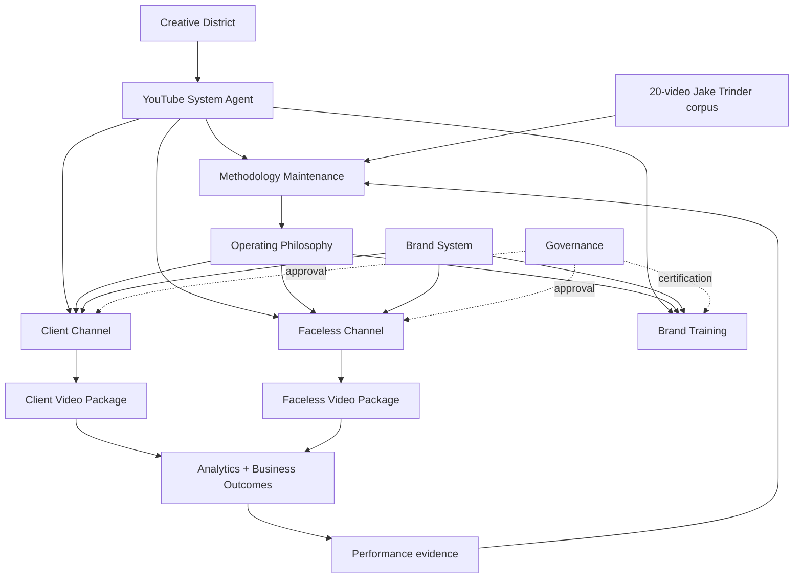

# YouTube System Agent graph

## Edge register

| From | Relationship | To |
|---|---|---|
| teaching corpus | evidence for | methodology maintenance |
| performance evidence | revises | operating philosophy |
| operating philosophy | constrains | every production/training workflow |
| brand system | constrains | client, faceless, training workflows |
| client brief | starts | client-channel workflow |
| niche charter | starts | faceless-channel workflow |
| approved video package | produces | performance evidence |
| governance | gates | account, client contact, spend, publish |
